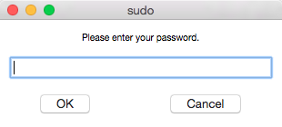
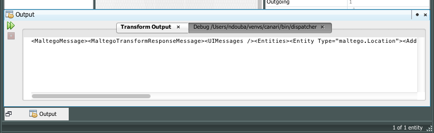

Canari Framework - Annotations & Extras (``canari.framework``)
**************************************************************

Annotations
===========
The Canari framework provides a few easy to use transform annotations and extras. Annotations are used to set transform
class attributes. Although you can set these attributes without the use of annotations, a good reason for using them is
to "pin" the presence of an important setting to the top of the class definition. For example, ``@RequireSuperUser``
marks the transform as a privileged transform, meaning it requires ``root`` privileges in order to execute. Whereas
``@Deprecated`` would signify that the transform has been deprecated, and so on. Annotations are applied to classes in
the following manner::

    @Deprecated
    class MyTransform(Transform):
        pass

Canari supports the following zero argument annotations:

.. csv-table::
    :header: Annotation,Meaning

    ``@RequireSuperUser``,the transform requires superuser privileges in order to execute.
    ``@Deprecated``,the transform is deprecated.
    ``@EnableRemoteExecution``,the transform can be used as a remote transform.
    ``@EnableDebugWindow``,the transform should operate in debug mode in Maltego.

Multiple annotations can be combined to achieve the desired transform profile. For example, if we want to enable the
debug window and have our user enter their superuser credentials, we would define the transform like so::

    @RequireSuperUser
    @EnableDebugWindow
    class MyTransform(Transform):
        pass

``@RequireSuperUser`` Behavior
------------------------------
As stated above, the ``@RequireSuperUser`` marks the transform as a privileged transform which requires ``root``
privileges in order to execute. The behavior of the different Canari transform runners differs when they come across a
transform that has this attribute set. When using :program:`canari run-transform`, :program:`canari debug-transform`,
:program:`dispatcher`, a graphical password dialog box will appear prompting the user to enter their sudo credentials.

    Canari sudo dialog box

When using the :program:`canari shell` or :program:`plume` (transform application server), Canari will ask whether or
not the user wishes to load superuser transforms. If the user chooses to load superuser transforms, Canari will rerun
the user's command using sudo, which will prompt the user for their credentials in the terminal. Here's an example of
what the sample output would look like::

    $ canari shell foo
    Looking for transforms in foo...
    Package loaded.
    A transform requiring 'root' access was detected. Would you like to run this shell as 'root'? [y/N]: y
    Need to be root to run this transform... sudo'ing...
    Password:
    Looking for transforms in foo...
    Package loaded.
    Welcome to Canari 3.0.
    >>>

``@EnableDebugWindow`` Behavior
-------------------------------
The ``@EnableDebugWindow`` annotation instructs the :program:`canari create-profile` to create a transform profile that
forces Maltego to display the "Debug" output pane each time the transform is executed. This is useful for debugging the
response XML or viewing debug or diagnostic messages being written to ``stderr``.

    Maltego "Debug" pane

.. note::

    Messages written to ``stderr`` during transform execution will only be seen if transforms are executed locally.
    Remote transforms do not transmit this information.

Request Filtering with ``@RequestFilter``
-----------------------------------------
Canari also supports the concept of transform request filtering by applying the ``@RequestFilter`` annotation to a
transform. This is especially useful for use-cases where a license or authorization check needs to be performed prior
to transform execution. For example, let's assume that you want to check whether a user is submitting a valid license
key prior to executing a transform request::

    def check_api_key(request, response, config):
        if not request.parameters['my_api.key'] == 'cool':
            raise MaltegoException('Invalid license key!')

    @RequestFilter(check_api_key)
    class MyTransform(Transform):
        def do_transform(request, response, config):
            # TODO: something cool
            return response

The :class:`RequestFilter` annotation accepts the following arguments in its constructor:

.. class:: RequestFilter(filter_[, remote_only=False])

    :param callable filter_: a callable that accepts three arguments: ``request``, ``response``, and ``config``.
    :param remote_only bool: ``True`` if the filter should only be applied when the transform is operating in remote
                             mode, otherwise ``False`` (default).

Just like the :meth:`Transform.do_transform` method, request filters can also modify the contents of the ``request``,
``response``, and ``config`` objects and raise exceptions, if necessary, to interrupt transform execution. Request
filters are expected to return either ``True``, to cancel transform execution, or ``False``, to allow the transform to
continue executing. The following example illustrates how you can gracefully interrupt the execution of a transform
and communicate the reason via a Maltego UI message::

    count = 0

    def check_access_count(request, response, config):
        global count
        if count == 500:
            response += UIMessage('Access denied: you have reached your limit.')
            return True
        count += 1

In the example above, our request filter is keeping track of a global request counter. If that counter reaches its
threshold, any subsequent transform requests will be cancelled and the user will be informed of the reason via a
Maltego informational UI message. Otherwise, the counter is incremented and transform execution continues.

.. attention::

    When a request filter returns ``True`` the current transform request will be cancelled and the empty or modified
    transform ``response`` object will be returned.

Request filtering can also be enabled for remote transforms only. This makes it easier to develop the transform locally,
void of any request filtering checks, by setting the `remote_only` keyword argument to ``True`` in your
``RequestFilter`` annotation, like so::

    def check_api_key(request, response, config):
        if not request.parameters['my_api.key'] == 'cool':
            raise MaltegoException('Invalid license key!')

    @RequestFilter(check_api_key, remote_only=True)
    class MyTransform(Transform):
        def do_transform(request, response, config):
            # TODO: something cool
            return response

In the example above, :func:`check_api_key` will only be called if :class:`MyTransform` is running in Plume.

Foreign Language Support
========================
If you've already developed your cool Maltego transforms in another language, such as Perl, Ruby, or Java, you can still
take advantage of Canari's powerful transform packaging and distribution features. By setting
:attr:`Transform.do_transform` to an instance of :class:`ExternalCommand` and placing your transform code in the
``<project name>/src/<project name>/resources/external`` directory, you have the ability to run transform code written
in other languages. For example, let's assume we've written a Perl transform, ``do_nothing.pl``, that we'd like to
package and distribute using the Canari framework::

    #!/usr/bin/perl

    print "<MaltegoMessage><MaltegoTransformResponseMessage/></MaltegoMessage>\n";

First, you'll have to create a transform::

    class DoNothing(Transform):
        do_transform = ExternalCommand('perl', 'do_nothing.pl')

Finally, you'll have to place the `do_nothing.pl` file in your ``<project name>/src/<project name>/resources/external``
directory (i.e. ``foo/src/foo/resources/external``).

.. seealso::

    Canari development quick-start guide for information on how to create a transform package and write transform code.

The :class:`ExternalCommand` constructor accepts the following arguments:

.. class:: ExternalCommand(interpreter, program[, args=None])

    :param str interpreter: the name of the program interpreter (i.e. :program:`perl`, :program:`java`, :program:`ruby`,
                            etc.)
    :param str program: the name of the transform script or executable file.
    :param iterable args: an optional list of arguments to pass to the transform executable or script.

In the event that ``interpreter`` is either `perl`, `ruby`, or `java`, the appropriate flags will be set to include the
``<project name>/src/<project name>/resources/external`` directory as part of the default module or class search path.
This is done to support relative module or library imports without having to modify your pre-existing code.
