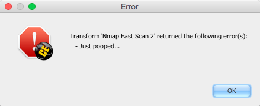
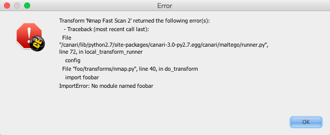
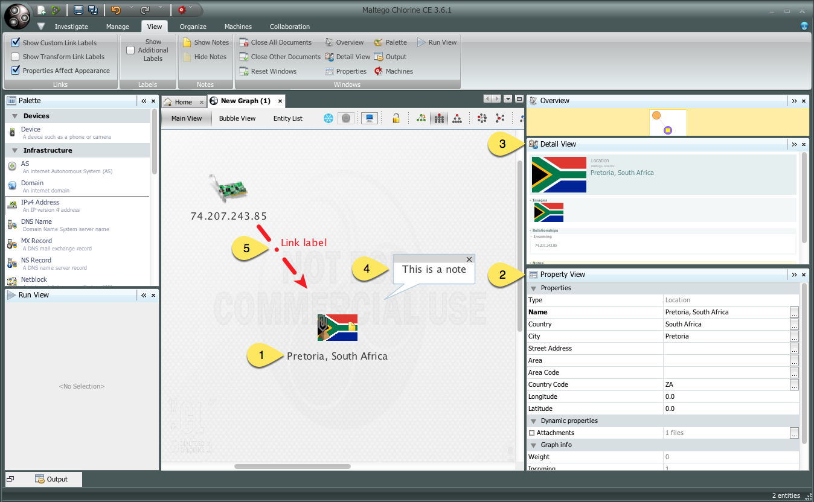
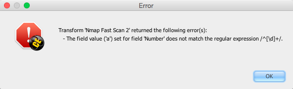
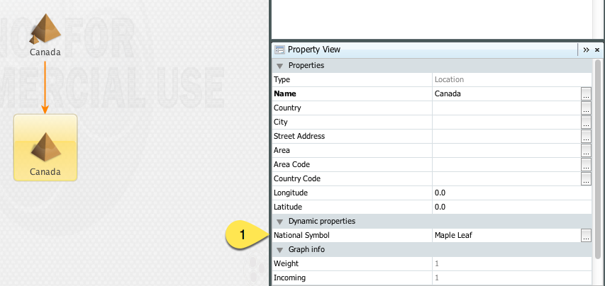
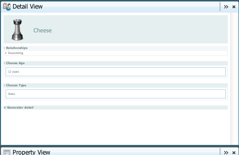

:mod:`canari.maltego.message` - Maltego Messaging Objects
=========================================================

.. module:: canari.maltego.message
    :synopsis: Maltego transform messaging objects.
.. moduleauthor:: Nadeem Douba <ndouba@redcanari.com>
.. sectionauthor:: Nadeem Douba <ndouba@redcanari.com>

.. versionadded:: 3.0

----

The :mod:`canari.maltego.message` module provides the complete implementation of all the Maltego transform messaging
objects. These objects are used to deserialize Maltego transform requests and serialize Canari transform responses for
both local and remote transforms. For example, the ``request`` and ``response`` objects that gets passed into the
:meth:`Transform.do_transform` method are instances of
:class:`~canari.maltego.message.MaltegoTransformRequest` and :class:`~canari.maltego.message.MaltegoTransformResponse`,
respectively.

All Maltego messaging objects are subclasses of the :class:`~canari.maltego.xml.MaltegoElement` super class, which adds
support for two arithmetic operations:

+------------+------------------------------------------------------------------------------+
| Operations | Meaning                                                                      |
+============+==============================================================================+
| ``p += c`` | Add a child object (``c``) to the parent object (``p``)                      |
+------------+------------------------------------------------------------------------------+
| ``p + c``  | Same as ``+=`` but it can be chained with multiple child objects.            |
+------------+------------------------------------------------------------------------------+

Here's an example demonstrating the use of these two arithmetic operations on the ``response`` object::

    from canari.maltego.transform import Transform
    from canari.maltego.entities import Phrase, Person

    class HelloWorld(Transform):

        input_type = Person

        def do_transform(self, request, response, config):
            person = request.entity
            response += Phrase('Hello %s!' % person.value)
            response = response + Phrase('Hello Mr(s) %s!' % person.lastname) \
                                + Phrase('Hello %s!' + person.firstname)
            return response

Finally, each messaging object can be separately serialized and deserialized to and from XML using the :meth:`render` and
:meth:`parse` methods::

    >>> from canari.maltego.entities import Phrase
    >>> print (MaltegoTransformResponseMessage() + Phrase('test')).render(pretty=True)
    <?xml version="1.0" ?>
    <MaltegoTransformResponseMessage>
        <UIMessages/>
        <Entities>
            <Entity Type="maltego.Phrase">
                <Value>test</Value>
                <Weight>1</Weight>
            </Entity>
        </Entities>
    </MaltegoTransformResponseMessage>
    >>> MaltegoTransformResponseMessage.parse('<MaltegoTransformResponseMessage/>')
    <canari.maltego.message.MaltegoTransformResponseMessage object at 0x10e99e150>

However, if you're a transform developer you will never really need to use the :meth:`render` or :meth:`parse` methods
as they are primarily used by the :program:`dispatcher`, :program:`canari debug-transform`, and :program:`plume`
transform runners.

Maltego Request and Response Objects
------------------------------------
The :class:`MaltegoTransformRequestMessage` and :class:`MaltegoTransformResponseMessage` represent the parent container
for Maltego request and response messages, respectively. When a transform is executed, Canari automatically deserializes
a request into a :class:`MaltegoTransformRequestMessage` object and creates an empty
:class:`MaltegoTransformResponseMessage`, which it then passes to :meth:`Transform.do_transform`.

Maltego transform request messages can be created using either the factory method :meth:`parse`, which accepts an XML
string whose root element is the ``<MaltegoTransformRequestMessage>`` tag, or by calling the empty constructor.

.. class:: MaltegoTransformRequestMessage(**kwarg)

    Return a new Maltego transform request message with no child elements. Each Maltego transform request message comes
    with the following read-only attributes:

    .. attribute:: limits

        A :class:`Limits` object which contains the soft and hard limits for the number of entities Maltego
        would like returned.

        One can access the soft and hard limits of a ``request`` object by doing the following::

            >>> print 'Transform hard limit=%s, soft limit=%s' % (request.limits.soft, request.limits.hard)
            Transform hard limit=500, soft limit=5000

        .. note:: :attr:`limits` do not apply to local transforms since the local transform adapter in Maltego does not
                  transmit this information.

    .. attribute:: parameters

        In **local transform execution mode**, :attr:`parameters` is a list of extraneous command line arguments
        not handled by the Canari :program:`dispatcher`. This is useful in scenarios where you want to use command line
        arguments to manage the behavior of a transform, for example::

                # transform executed using 'dispatcher foo.transforms.HelloWorld -u Bob'
                def do_transform(self, request, response, config):
                    """If '-u' detected in command line arguments make entity value all upper case."""
                    if '-u' in request.parameters:
                        response += Phrase('Hello %s!' + request.entity.value.upper())
                    else:
                        response += Phrase('Hello %s!' + request.entity.value)
                    return response

        In **remote transform execution mode**, :attr:`parameters` is a dictionary of additional transform fields,
        keyed by their names. Transform fields are typically used to communicate additional transform parameters. For
        example, many commercial transforms use the transform field to transmit API keys. Alternatively, one can use
        transform fields to alter transform behaviour - just like in our local mode example. The following is an example
        of a custom transform that expects an API key::

                # ...
                def do_transform(self, request, response, config):
                    fields = request.parameters
                    if 'my.license' not in fields or not valid_api_key(fields['my.license'].value):
                        raise MaltegoException('Invalid API key! Send cheque!')
                    response += Phrase('Hello %s!' + request.entity.value)
                    return response

        .. note:: If you intend to use a transform package in both local and remote mode, make sure to check Canari's
                  operating mode prior to accessing :attr:`parameters`. See :mod:`canari.mode` for more information.

    .. attribute:: entity

        The :class:`Entity` object to be processed by the Canari transform. The entity object's type is
        determined by the value of the :attr:`Transform.input_type` attribute. If `Transform.input_type` is not set
        explicitly, then :attr:`entity` will return an entity of type :class:`~canari.maltego.entities.Unknown`. For
        example, a :class:`~canari.maltego.entities.Person` entity will always be returned in the following transform::

            class HelloWorld(Transform):
                # Ensure request.entity returns a Person object
                input_set = Person

                def do_transform(self, request, response, config):
                    person = request.entity
                    response += Phrase('Hello %s!' + person.fullname)
                    return response

:class:`MaltegoTransformResponseMessage` can be created in the same way as our request objects; either by using
:meth:`parse` or by using the constructor explicitly.

.. class:: MaltegoTransformResponseMessage(**kwarg)

    Return a new Maltego transform response message object with no child elements. The various attributes of the
    response can also be manipulated using regular list operations via these attributes:

    .. attribute:: messages

        A list of :class:`UIMessage` objects that contain user interface messages to be displayed in Maltego's
        "Transform Output" pane or in a dialog window. For example, let's say we wanted to display a fatal message::

            # ...
            def do_transform(self, request, response, config):
                response += UIMessage("This transform is not implemented yet!", type=UIMessageType.Fatal)
                return response

        This would result in the following message box appearing in Maltego:

        .. figure:: images/uimessage_fatal.png
            :align: center
            :alt: Fatal UI message appearance

            Fatal UI message appearance

        .. seealso::

            :class:`UIMessage` for an overview of the different message types and how they are rendered in Maltego's UI.

    .. attribute:: entities

        The list of :class:`Entity` objects to be returned as transform results to the Maltego UI. Entities can be added
        to a response message by using the ``+=`` operator, like so::

            # ...
            def do_transform(self, request, response, config):
                response += Location('Brooklyn')
                return response

        Or by using the ``+`` operator to chain multiple entity results in one line, like so::

            # ...
            def do_transform(self, request, response, config):
                return (response + Location('Brooklyn') + Location('Broadway'))

Communicating Exceptions
------------------------
Using :class:`MaltegoExceptionResponseMessage` objects, a transform can communicate an error state back to the Maltego
user. Canari generates a Maltego exception object if an exception is raised during transform execution. There are two
different behaviours when it comes to reporting exceptions. If a transform raises a :exc:`MaltegoException` then the
exception message is what's communicated to the user. However, other exception types will render a message box with
full stack trace details. Here's a visual example::

    # ...
    def do_transform(self, request, response, config):
        raise MaltegoException('Just pooped!')

Results in the following dialog box:

    :exc:`MaltegoException` exception appearance

Whereas::

    # ...
    def do_transform(self, request, response, config):
        import foobar # non-existent module

Results in the following dialog box:

    Non-:exc:`MaltegoException` exception appearance

.. warning::

    Users who are security conscious may find this behaviour undesirable since full stack traces often disclose
    internal information such as file system paths, and module names. Support for cross-referencable logs and
    generic error messaging will appear in Canari v3.1.

Communicating Diagnostic Information
------------------------------------
A second form of communicating status or diagnostic information is via the use of :class:`UIMessage` objects. UI
messages either appear in the "Transform Output" pane (usually at the bottom) or as dialog message boxes depending on
the message type assigned to them. For your convenience, Canari has defined all the different UI message types as class
attributes in :class:`UIMessageType`:

.. class:: UIMessageType

    .. attribute:: Fatal

        Fatal errors are communicated to Maltego users using a dialog message box.

    .. attribute:: Partial

        Partial errors are communicated to Maltego users in the "Transform Output" pane and are orange in color.

    .. attribute:: Inform

        Informational errors are communicated to Maltego users in the "Transform Output" pane but are not colored.

    .. attribute:: Debug

        These errors do not appear to be displayed anywhere in the Maltego user interface. Instead they may appear in
        debug logs.

Communicating diagnostic information to a Maltego user is simple. Simply, use the ``+=`` or ``+`` operators to add
a :class:`UIMessage` object to a response object, like so::

    # ...
    def do_transform(self, request, response, config):
        import time
        response += Phrase('Hello sleepy head!')
        time.sleep(3)
        response += UIMessage("This transform took 3 seconds to complete.", type=UIMessageType.Inform)
        return response

The :class:`UIMessage` accepts two arguments, ``msg`` and ``type``.

.. class:: UIMessage(message, [type=UIMessageType.Inform])

    :arg str message:               The message to communicate to the Maltego user.
    :keyword UIMessageType type:    The type of message to communicate to the user (default:
                                    :attr:`UIMessageType.Inform`).

    Values for ``message`` and ``type`` can also be set via these attributes:

    .. attribute:: type

        The type of message that will be communicated. Valid values for this attribute are defined in
        :class:`UIMessageType`.

    .. attribute:: message

        The message to communicate to the user.

Local transforms also support real-time diagnostic messaging. See :func:`~canari.maltego.utils.debug` and
:func:`~canari.maltego.utils.progress` for more information.

Using and Defining Maltego Entities
-----------------------------------
An entity in Maltego is comprised of several elements:

#. **A default entity value:** the default property which appears under the Maltego entity on the graph.
#. **Fields:** extra properties belonging to an entity that get passed to transforms as input. These appear in
   the "Properties View" pane in Maltego. The default entity value is also represented as a property.
#. **Labels:** read-only information that's used to display additional information about an entity. Labels do not get
   used as transform input. Labels appear in the "Detail View" pane in Maltego.
#. **Notes:** additional notes that are associated with a particular entity. Like labels, notes are not used as
   transform input. Notes can be viewed in the "Entity Viewer" or on the graph as a call-out.
#. **Link and Entity Decorations:** usually set by a transform on all its output entities to decorate the look and feel
   of a link (i.e. line thickness, style, etc.) or entity (i.e. bookmarking, icons, etc.). Decorations appear directly
   on the graph.

    Maltego entity composition

Canari uses the :class:`Entity` type to define Maltego entities programmatically. All Canari entities are subclasses of
the :class:`Entity` type. :class:`Entity` objects are used in both request and response messages. Canari comes with a
list of pre-defined entity types that correspond to the built-in types in Maltego. These types can be found in
:mod:`canari.maltego.entities`. Defining a custom entity in Canari is as simple as this::

    >>> from canari.maltego.message import Entity, StringEntityField
    >>> class Threat(Entity):
    ...    name = StringEntityField('threat.name', is_value=True)
    ...    country = StringEntityField('threat.country')
    ...
    >>> t = Threat('Cheese', country='Switzerland')
    >>> print 'Detected threat %r from %s' % (t.name, t.country)
    Detected threat 'Cheese' from Switzerland.

In the example above we are defining a custom entity of type :class:`Threat` with two string entity fields, :attr:`name`
and :attr:`country`. The ``is_value`` keyword argument in our ``name`` entity field definition instructs Canari that
``name`` is the entity's default value. As a result, we can set the value of ``name`` via the entity's first argument in
the constructor. Alternatively, we could have completely omitted the definition of ``name`` since all entity objects
have an entity :attr:`value` attribute. All other entity fields can be set using a keyword argument that matches the
attribute's name.

:class:`Entity` objects can be instantiated in the following manner:

.. class:: Entity(value='', **kwarg)

    :param str value: the default entity field value.

    You can also pass the following additional keyword arguments:

    :keyword str type:      The entity's type name (default: ``<package name>.<class name>``).
    :keyword str value:     The entity's default entity field value.
    :keyword float weight:  The entity's weight value from 0.0 to 1.0. Useful for transforms that return ranked
                            search result entities from search engines.
    :keyword str icon_url:   The entity's icon URL. Maltego supports the built-in Java URL protocol schemes
                            (``file://``, ``http://``, ``https://``, etc.).
    :keyword list fields:   A list of entity fields, of type :class:`Field`, to be added to the entity.
    :keyword list labels:   A list of entity labels, of type :class:`Label`, to be added to the entity.

    The following attributes are also inherited by all the subclasses of the :class:`Entity` type:

    .. attribute:: value

        The default entity value (what appears under the entity's icon in the Maltego graph) as a string.

    .. attribute:: icon_url

        A string containing a valid URL to an image (i.e. ``file:///tmp/foo.png``, ``http://bar.com/foo.gif``, etc.) to
        be used as the entity's icon.

        .. figure:: images/maltego_icon_url.png
            :align: center
            :alt: Maltego entity icon

            Maltego entity icon

    .. attribute:: labels

        A dictionary of :class:`Label` objects keyed by their names. Labels appear in the "Detail View" pane in the
        Maltego GUI and are often used to display text fragments, additional information, or hyperlinks that a user
        can click on for more information.

        .. note::

            Labels are not transmitted with input entities on transform requests. If you wish to include information from
            a label in a transform request, then that information should reside in an entity field.

        Adding a label to an entity is as easy using the ``+=`` operator or passing a list of :class:`Label` objects to
        the entity constructor, like so::

            >>> t = Threat('Cheese', country='Switzerland', labels=[Label('Cheese Type', 'Swiss')])
            >>> t += Label('Cheese Age', '12 years')

        Which would result in the following content being rendered in the "Detail View" pane in Maltego's UI:

        .. figure:: images/maltego_detail_view.png
            :align: center
            :alt: Entity labels in "Detail View"

            Entity labels in "Detail View"

    .. attribute:: fields

        A dictionary of :class:`Field` objects keyed by their names. Entity fields are read-write properties that
        appear in the "Properties View" pane in the Maltego GUI and are used as input for transform requests.

        .. figure:: images/maltego_property_view.png
            :align: center
            :alt: Entity fields in "Properties View"

            Entity fields in "Properties View"

    .. attribute:: notes

        A string containing additional notes that can be attached to a Maltego entity. You can set a note in the
        following manner::

            >>> Threat('Cheese', country='Switzerland', note='This is a note') # or
            >>> t = Threat('Wine', country='Italy')
            >>> t.note = 'This is another note'

        The following figure demonstrates the appearance of an entity note in Maltego:

        .. figure:: images/maltego_note.png
            :align: center
            :alt: Maltego Entity Note

            Maltego Entity Note

        .. note::

            Entity notes are not transmitted as transform input. Consider adding an additional entity field that
            encapsulates the information in your notes if you wish to pass it to your transforms as input.

    .. attribute:: bookmark

        Determines whether an entity should be marked with a colored star. Can be one of the following values:

        .. csv-table::
            :header: Value,Appearance

            :attr:`Bookmark.NoColor`,|bookmark_nocolor| **(default)**
            :attr:`Bookmark.Cyan`,|bookmark_cyan|
            :attr:`Bookmark.Green`,|bookmark_green|
            :attr:`Bookmark.Yellow`,|bookmark_yellow|
            :attr:`Bookmark.Orange`,|bookmark_orange|
            :attr:`Bookmark.Red`,|bookmark_red|

        .. |bookmark_nocolor| image:: images/bookmark_nocolor.png
        .. |bookmark_cyan| image:: images/bookmark_cyan.png
        .. |bookmark_green| image:: images/bookmark_green.png
        .. |bookmark_yellow| image:: images/bookmark_yellow.png
        .. |bookmark_orange| image:: images/bookmark_orange.png
        .. |bookmark_red| image:: images/bookmark_red.png

        Here's an example of how to set a bookmark::

            >>> from canari.maltego.message import Bookmark
            >>> Threat('Cheese', country='Switzerland', bookmark=Bookmark.Red) # or
            >>> t = Threat('Wine', country='Italy')
            >>> t.bookmark = Bookmark.Cyan

        The following figure demonstrates the appearance of an entity bookmark in Maltego:

        .. figure:: images/maltego_bookmark.png
            :align: center
            :alt: Maltego entity bookmark

            Maltego entity bookmark

    .. attribute:: link_label

        A string attribute that adds a label to the link that connects the parent and child entity. Like notes, link
        labels can be set via the ``link_label`` keyword argument in the constructor or by accessing the ``link_label``
        attribute. Here's an example of the link label in action::

            # ...
            def do_transform(self, request, response, config):
                return (response + IPv4Address('74.207.243.85', link_label='This is a link label'))

        This is what it would look like in Maltego:

        .. figure:: images/maltego_link_label.png
            :align: center
            :alt: Link label appearance

            Link label appearance

        Link labels can be shown or hidden by setting the :attr:`link_show_label`.

    .. attribute:: link_show_label

        Determines whether or not the link label will be shown based on the following values:

        .. csv-table::
            :header: Value,Meaning

            :attr:`LinkLabel.UseGlobalSetting`,The visibility of the link label will depend on the global setting.
            :attr:`LinkLabel.Show`,The link label will be visible on the graph.
            :attr:`LinkLabel.Hide`,The link label value will be set but will not be visible on the graph.

        The global setting can be found under the "View" ribbon within the "Links" settings group.

        .. figure:: images/maltego_global_label_visibility_settings.png
            :align: center
            :alt: Maltego global link label visibility setting

            Maltego global link label visibility setting

        Here's an example of the link visibility setting in action::

            from canari.maltego.message import LinkLabel
            # ...
            def do_transform(self, request, response, config):
                return (response + IPv4Address('74.207.243.85', link_show_label=LinkLabel.Hide))

    .. attribute:: link_style

        Dictates the appearance of the link's line, which can be one of the following choices:

        .. csv-table::
            :header: Value,Appearance

            :attr:`LinkStyle.Normal`,|link_style_normal| **(default)**
            :attr:`LinkStyle.Dashed`,|link_style_dashed|
            :attr:`LinkStyle.Dotted`,|link_style_dotted|
            :attr:`LinkStyle.DashDot`,|link_style_dashdot|

        .. |link_style_normal| image:: images/link_style_normal.png
        .. |link_style_dashed| image:: images/link_style_dashed.png
        .. |link_style_dotted| image:: images/link_style_dotted.png
        .. |link_style_dashdot| image:: images/link_style_dashdot.png

        Here's an example of the link style in action::

            from canari.maltego.message import LinkStyle
            # ...
            def do_transform(self, request, response, config):
                return (response + IPv4Address('74.207.243.85', link_style=LinkStyle.DashDot))

        This is what it would look like in Maltego:

        .. figure:: images/maltego_link_style.png
            :align: center
            :alt: Link style appearance

            Link style appearance

    .. attribute:: link_color

        Dictates the color of the link connecting the parent and child entities. The link color is limited to the
        following values:

        .. csv-table::
            :header: Value,Appearance

            :attr:`LinkColor.Black`,|link_color_black|
            :attr:`LinkColor.DarkGray`,|link_color_darkgray| **(default)**
            :attr:`LinkColor.LightGray`,|link_color_lightgray|
            :attr:`LinkColor.Red`,|link_color_red|
            :attr:`LinkColor.Orange`,|link_color_orange|
            :attr:`LinkColor.DarkGreen`,|link_color_darkgreen|
            :attr:`LinkColor.NavyBlue`,|link_color_navyblue|
            :attr:`LinkColor.Magenta`,|link_color_magenta|
            :attr:`LinkColor.Cyan`,|link_color_cyan|
            :attr:`LinkColor.Lime`,|link_color_lime|
            :attr:`LinkColor.Yellow`,|link_color_yellow|
            :attr:`LinkColor.Pink`,|link_color_pink|

        .. |link_color_black| image:: images/link_color_black.png
        .. |link_color_darkgray| image:: images/link_color_darkgray.png
        .. |link_color_lightgray| image:: images/link_color_lightgray.png
        .. |link_color_red| image:: images/link_color_red.png
        .. |link_color_orange| image:: images/link_color_orange.png
        .. |link_color_darkgreen| image:: images/link_color_darkgreen.png
        .. |link_color_navyblue| image:: images/link_color_navyblue.png
        .. |link_color_magenta| image:: images/link_color_magenta.png
        .. |link_color_cyan| image:: images/link_color_cyan.png
        .. |link_color_lime| image:: images/link_color_lime.png
        .. |link_color_yellow| image:: images/link_color_yellow.png
        .. |link_color_pink| image:: images/link_color_pink.png

        Here's an example of the link color in action::

            from canari.maltego.message import LinkColor
            # ...
            def do_transform(self, request, response, config):
                return (response + IPv4Address('74.207.243.85', link_color=LinkColor.Red))

        This is what it would look like in Maltego:

        .. figure:: images/maltego_link_color.png
            :align: center
            :alt: Maltego link color

            Maltego link color

    .. attribute:: link_thickness

        Dictates the thickness of the link connecting the parent and child entities. Valid values range from ``0`` to
        ``5``. The greater the number, the thicker the link and vice versa. Here's an example of the link thickness in
        action::

            # ...
            def do_transform(self, request, response, config):
                return (response + IPv4Address('74.207.243.85', link_thickness=5))

        This is what it would look like in Maltego:

        .. figure:: images/maltego_link_thickness.png
            :align: center
            :alt: Maltego link thickness

            Maltego link thickness

Defining Entity Fields
^^^^^^^^^^^^^^^^^^^^^^
Entity fields can be added to an entity in two ways, dynamically and statically. The dynamic approach is recommended in
cases where an entity field is not part of the standard entity's definition. For example, if we wanted to attach an
additional field, "Tracking Code", to Maltego's built-in :class:`WebSite` entity, we can do so like this::

    >>> from canari.maltego.entities import WebSite
    >>> w = WebSite('www.google.com')
    >>> w += Field('tracking.code', '123456789', display_name='Tracking Code')

However, if we were looking to use the pre-defined entity fields, defined for a particular entity, we can simplify our
code by defining entity field properties in Canari. Entity field properties provide a simple and clean interface to
get and set values of entity fields in a Pythonic way::

    >>> from canari.maltego.message import *
    >>> class MyEntity(Entity):
    ...     foo = StringEntityField('foo')
    ...
    >>> e = MyEntity()
    >>> e.foo = 1
    >>> e.foo
    '1'
    >>> MyEntity(foo=2).foo
    '2'

.. seealso::

    See :class:`Field` for more information on constructing dynamic fields.

Canari comes with 11 pre-defined entity field types to aid with entity object interaction in your transforms. These
entity field types take care of marshalling field data into the appropriate type (i.e. from string to integer, or float,
etc.). This is useful for performing rudimentary input validation in your transforms and can ensure that the data is
properly formatted for Maltego as well. For example, the :class:`EnumEntityField` can be used to ensure that an entity
field's value is restricted to a limited set of acceptable values::

    >>> class Car(Entity):
    ...     fuel = EnumEntityField('car.fuel.type', choices=['diesel', 'petroleum'])
    ...
    >>> toyota = Car(fuel='diesel')
    >>> volvo = Car(fuel='water')
    Traceback (most recent call last):
        ...
    ValidationError: Invalid value ('water') set for field 'car.fuel.type'. Expected one of these values: ['diesel', 'petroleum'].

All entity field types with exception to the :class:`StringEntityField` raise a :exc:`ValidationError` if an invalid
value is set. Input validation is also performed when retrieving field values from input entities as well.

.. note::

    Input validation is not immediately performed on input entity fields. Instead, input validation checks are performed
    when a transform attempts to access a strong-typed input entity field.

Validation errors appear in a user friendly manner within the Maltego GUI, like so:

    Input validation error

The following entity field types are supported in Canari:

.. csv-table::
    :header: Entity Field Type,Accepted Types

    :class:`StringEntityField`,"All (if not :class:`str`, then result of :meth:`object.__str__` is used)."
    :class:`EnumEntityField`,Values defined in list of ``choices``.
    :class:`IntegerEntityField`,:class:`int`
    :class:`BooleanEntityField`,:class:`bool`
    :class:`FloatEntityField`,:class:`float`
    :class:`LongEntityField`,:class:`long`
    :class:`DateTimeEntityField`,:class:`datetime`
    :class:`DateEntityField`,:class:`date`
    :class:`TimeSpanEntityField`,:class:`timedelta`
    :class:`RegexEntityField`,:class:`str` that contains a regex pattern used in :func:`re.match`.
    :class:`ColorEntityField`,:class:`str` that contains RGB color code (i.e. ``'#FF0000'``)

All entity field types are subclasses of :class:`StringEntityField` and can be constructed in the following manner:

.. class:: StringEntityField(name, **extras)

    :arg str name: The "Unique property name" of the entity field in Maltego.

    The constructor also accepts the following keyword arguments:

    :keyword str description: The "Description" of the entity field in Maltego.
    :keyword str display_name: The "Property display name" of the entity field in Maltego.
    :keyword MatchingRule matching_rule: The default matching rule for the entity field (default: :attr:`MatchingRule.Strict`).
    :keyword str alias: The alias for the "Unique property name". Used for backwards compatible entity fields.
    :keyword str error_msg: The custom error message that gets displayed when a :exc:`ValidationError` is raised.
    :keyword bool is_value: ``True`` if the property is the main property, else ``False`` (default).
    :keyword callable decorator: A :class:`callable` object (function, method, etc.) that gets called each time the
                                 entity field is set. Useful for automating entity decoration, such as applying an
                                 entity icon based on the value of the field, or deriving the value of a field based on
                                 another field's value.

    The following figure illustrates the mapping between the entity field's ``name`` (2), ``description`` (3),
    ``display_name`` (4) keyword arguments for a :class:`StringEntityField` and the form fields in Maltego's entity
    field wizard:

    .. figure:: images/maltego_entity_field.png
        :align: center
        :alt: Maltego entity field code to GUI mappings

        Maltego entity field code to GUI mappings

    When adding an entity field using the entity editor the ``name`` (1) and ``display_name`` (3) mappings can be seen
    below:

    .. figure:: images/maltego_entity_field_editor.png
        :align: center
        :alt: Adding a field using Maltego entity field editor

        Adding a field using Maltego entity field editor

    The field's ``description`` (2) can be set after an entity field is added by selecting the field from the left-hand
    pane and editing the field's description in the right-hand pane of the "Additional Properties" tab in the Maltego
    entity editor.

    .. figure:: images/maltego_entity_field_editor_description.png
        :align: center
        :alt: Setting the description of a new entity field.

        Setting the description of a new entity field.

    Defining the entity fields in the figures above using Canari would result in the following code::

        class Threat(Entity):
            name = StringEntityField('threat.name', display_name='Threat Name',
                                     is_value=True, description='Name of the threat')
            ip_address = StringEntityField('threat.ipaddress', display_name='Threat IP',
                                           description='Threat IP address.')

    Now let's say we wanted to add the geographic location that the IP address originates from. We can do this manually
    but it would probably be easier to use an entity field decorator. First, we'll add a ``location`` entity field::

        class Threat(Entity):
            name = StringEntityField('threat.name', display_name='Threat Name',
                                     is_value=True, description='Name of the threat')
            ip_address = StringEntityField('threat.ipaddress', display_name='Threat IP',
                                           description='Threat IP address.')
            location = StringEntityField('threat.location', display_name='Threat Location',
                                         description='Threat location.')

    Next we need to create a decorator function that accepts two arguments: the entity object, and the new field value.
    We'll use `FreeGeoIP.net's <http://freegeoip.net>`_ REST-based JSON web API to lookup location information for a
    particular IP address and apply it to the :attr:`ip_address` field::

        import json
        from urllib2 import urlopen

        def geo_locate(threat, ip):
            threat.location = json.load(urlopen('https://freegeoip.net/json/%s' % ip))['country_name']

        class Threat(Entity):
            name = StringEntityField('threat.name', display_name='Threat Name',
                                     is_value=True, description='Name of the threat')
            ip_address = StringEntityField('threat.ipaddress', display_name='Threat IP',
                                           description='Threat IP address.', decorator=geo_locate)
            location = StringEntityField('threat.location', display_name='Threat Location',
                                         description='Threat location.')

    Let's take a look at the decorator in action (there may be a delay if you're on a slow network)::

        >>> t = Threat('foo', ip_address='4.2.2.1')
        >>> print t.location
        United States

The :class:`EnumEntityField` and :class:`RegexEntityField` types accept additional keyword arguments in their
constructors in addition to the arguments accepted by the :class:`StringEntityField` type.

.. class:: EnumEntityField(name, choices=[], **extras)

    :keyword iterable choices: an iterable of choices for valid values the entity field will accept.
    :raises ValueError: if ``choices`` is empty or ``None``.

    In the event that an entity's field is set to a value that is not specified in the ``choices`` keyword argument, a
    :exc:`ValidationError` will be raised. Let's add a threat level entity field to our :class:`Threat` entity to
    demonstrate the use of :class:`EnumEntityField` types::

        class Threat(Entity):
                # ...
                threat_level = EnumEntityField('threat.level', display_name='Threat Level',
                                               choices=[1,2,3,4,5], description='Threat level.')

    Let's see the :attr:`threat_level` field in action::

        >>> t = Threat('foo', threat_level=1)
        >>> t.threat_level = 6
        Traceback (most recent call last):
            ...
        ValidationError: Invalid value ('6') set for field 'Threat Level'. Expected one of these values: ['1', '2', '3', '4', '5'].

    .. note::

        :class:`EnumEntityField` entity fields convert all objects in the ``choices`` iterable to strings using the
        :func:`str` function.

.. class:: RegexEntityField(name, pattern='.*', **extras)

    :keyword str pattern: a regular expression pattern that gets used with :func:`re.match`.

    Each time the field's value is set or retrieved, a call to :func:`re.match` is made with the specified ``pattern``.
    If the value doesn't match the pattern then a :exc:`ValidationError` is raised. Let's add a threat identifier to our
    previous entity. We'll require users to enter the threat ID using the following syntax ``'threat-0000'``::

        class Threat(Entity):
                # ...
                threat_id = RegexEntityField('threat.id', display_name='Threat ID',
                                            pattern='^threat-\d{4}$', description='Threat unique identifier.')

    Let's see the :attr:`threat_id` field in action::

        >>> t = Threat('foo', threat_id='threat-0123')
        >>> t.threat_id = 'threat-12345'
        Traceback (most recent call last):
            ...
        ValidationError: The field value ('threat-12345') set for field 'Threat ID' does not match the regular expression /^threat-\d{4}$/.
        >>> t.threat_id = '12345'
        Traceback (most recent call last):
            ...
        ValidationError: The field value ('12345') set for field 'Threat ID' does not match the regular expression /^threat-\d{4}$/.

Customizing :exc:`ValidationError` Error Messages
^^^^^^^^^^^^^^^^^^^^^^^^^^^^^^^^^^^^^^^^^^^^^^^^^
You may have noticed that the error messages above are generic in nature. The good news is that you can specify a more
user-friendly error message for :exc:`ValidationError` exceptions by specifying the ``error_msg`` keyword argument in
your entity field definition. Error messages are formatted using the :func:`str.format` method and ``'{var}'`` string
notation. Each entity field type accepts the following string formatting arguments:

.. csv-table::
    :header: Type,Error Message Arguments

    :class:`StringEntityField`,Not applicable.
    :class:`EnumEntityField`,"``field``, ``value``, ``expected``"
    :class:`IntegerEntityField`,"``field``, ``value``"
    :class:`BooleanEntityField`,"``field``, ``value``"
    :class:`FloatEntityField`,"``field``, ``value``"
    :class:`LongEntityField`,"``field``, ``value``"
    :class:`DateTimeEntityField`,"``field``, ``value``"
    :class:`DateEntityField`,"``field``, ``value``"
    :class:`TimeSpanEntityField`,"``field``, ``value``"
    :class:`RegexEntityField`,"``field``, ``value``, ``pattern``"
    :class:`ColorEntityField`,"``field``, ``value``"

For example, if we wanted to modify the :attr:`threat_level` entity field's (of type :class:`EnumEntityField`)
default error message in our previous example, we can do this like so::

    class Threat(Entity):
                # ...
                threat_level = EnumEntityField('threat.level', display_name='Threat Level',
                                               choices=[1,2,3,4,5], description='Threat level.',
                                               error_msg='{field!r}: {value!r} not in {expected!r}.')

Then our error message would look like this when we encounter a :exc:`ValidationError` exception::

    >>> t = Threat('foo', threat_level=1)
    >>> t.threat_level = 6
    Traceback (most recent call last):
        ...
    ValidationError: 'Threat Level': '6' not in ['1', '2', '3', '4', '5'].

.. seealso::

    For a comprehensive overview of string formatting syntax, see the
    `Format String Syntax <https://docs.python.org/2/library/string.html#format-string-syntax>`_ section in the official
    Python documentation.

Creating Custom Entity Field Types
^^^^^^^^^^^^^^^^^^^^^^^^^^^^^^^^^^
Entity field types are glorified `Python property objects <https://docs.python.org/2/library/functions.html#property>`_
and subclasses of the :class:`StringEntityField` type. You can either subclass :class:`StringEntityField` directly, or
leverage one of the many other entity field types available to you and augment their constructors, getters, and setters
as required. Let's take a look at how we can create a
`digest <https://en.wikipedia.org/wiki/Cryptographic_hash_function>`_ entity field that expects hash values in ascii hex
format using the :class:`RegexEntityField` type::

    class DigestEntityField(RegexEntityField):
        def __init__(self):
            super(DigestEntityField, self).__init__('content.digest', pattern='^[A-Fa-f0-9]$',
                                                    description="The message's digest.",
                                                    display_name='Message Digest',
                                                    error_msg='{field!r}: invalid message digest: {value!r}!')

    class Document(Entity):
        digest = DigestEntityField()

    class DataPacket(Entity):
        digest = DigestEntityField()

This can significantly simplify and centralize refactoring efforts on entity fields in cases where the same entity field
definition is reused in many other unrelated entity types. Alternatively, you can follow this template if you wish to
implement something a bit more complex for field value validation::

    class MyEntityField(StringEntityField):

        error_msg = 'A default error message with {field} and {value} and other variables if you wish.'

        def __init__(self, name, **extras):
            super(MyEntityField, self).__init__(name, **extras)
            # TODO: store any extra attributes that are not handled by StringEntityField.

        def __get__(self, obj, objtype):
            value = super(RegexEntityField, self).__get__(obj, objtype) # get field value
            # TODO: type conversions if necessary
            self.validate(value)
            return value

        def __set__(self, obj, value):
            # TODO: type conversions if necessary
            self.validate(value)
            super(RegexEntityField, self).__set__(obj, value) # set field value

        def validate(self, value):
            is_valid = True # TODO: implement some sort of validation
            if not is_valid:
                raise ValidationError(self.get_error_msg(self.display_name or self.name, value))

Adding Additional Information to Entities
^^^^^^^^^^^^^^^^^^^^^^^^^^^^^^^^^^^^^^^^^
Sometimes you want to display additional information to users. Either because it doesn't fall into one of the entity's
predefined fields or it's just informational data that isn't required for subsequent transform requests. For these use-
cases, Canari provides two classes, :class:`Field` and :class:`Label`, that can be used to define dynamic entity fields
and read-only information, respectively.

:class:`Field` is the underlying data container for all the entity field types mentioned in the previous sections,
above. In fact, if you took a look at the :attr:`fields` attribute in an :class:`Entity` object, you'd notice the
presence of this objects in a dictionary. As mentioned earlier, :class:`StringEntityField` and friends are merely
proxies to the :attr:`fields` dictionary. A field object can be constructed in the following manner:

.. class:: Field(name, value, display_name='', matching_rule=MatchingRule.Strict)

    :param str name: the unique field identifier, usually in dotted form (i.e. 'threat.name')
    :param str value: the value of the field or property.
    :param str display_name: the user-friendly name of the field (i.e. 'Threat Name')
    :param MatchingRule matching_rule: the matching rule for this field, either :attr:`MatchingRule.Strict` (default) or
                                       :attr:`MatchingRule.Loose`.

.. seealso::

    :ref:`Matching rules<matching_rules>` for more information on matching rules and how they relate to Maltego graph behavior.

Fields that are pre-defined (or statically defined) for a particular entity in Maltego do not require the specification
of the ``display_name`` argument. The display name defined in Maltego will be used instead. The ``display_name``
argument is particularly important for dynamic fields (fields that are not part of the entity definition in Maltego).
If omitted, and the field is dynamic, Maltego will name the field "Temp" in the "Properties View" pane. Dynamic fields
can be attached to entities in Canari in the following manner::

    >>> from canari.maltego.entities import *
    >>> l = Location('Canada')
    >>> l += Field('location.symbol', 'Maple Leaf', display_name='National Symbol')

In the example above, we've added a previously undefined field, 'location.symbol', and added it to the builtin
:class:`Location` entity in Maltego. The figure below illustrates the look and feel of a dynamic property (1) in
Maltego:

    Dynamic entity field/property

Like static fields, dynamic fields get passed to transforms as input. Retrieving a dynamic field from a transform is as
simple as accessing the entity's :attr:`fields` attribute. Continuing from our last example::

    >>> print l['location.symbol'].value
    Maple Leaf

.. note::

    Dynamic field values are always return as an instance of :class:`str` and need to be manually marshalled into their
    appropriate types and validated, if necessary.

Now, let's say we wanted to attach additional information to the entity that we do not want to pass as transform input.
Labels serve this purpose and allow transform developers to set both text- and HTML-based content in the Maltego
"Details View" pane.

    Entity labels in "Detail View"

:class:`Label` objects can be constructed in the following manner:

.. class:: Label(name, value[, type='text/text'])

    :param str name: The title or name of the label.
    :param str value: The content that will appear under the label's name.
    :param str type: A MIME type identifying the content's type; either ``'text/text'`` (default) or
                     ``'text/html'``.

Adding labels to an entity is the same as adding dynamic fields::

    >>> t = Threat('Cheese', country='Switzerland')
    >>> t += Label('Age', '12 years')

By default, fields are rendered as regular text. If you want to render HTML in the "Details View" you can do so by
setting ``type`` to ``'text/html'`` and ``value`` to an HTML fragment, like so::

    >>> t = Threat('Cheese', country='Switzerland')
    >>> t += Label('Table', '<table><tr><th>header</th></tr><tr><td>row</td></tr></table>', 'text/html')

.. _matching_rules:

Matching Rules and Maltego
^^^^^^^^^^^^^^^^^^^^^^^^^^
Maltego supports the concept of matching rules for entity fields. A matching rule defines how an output entity (returned
by a transform) is merged with other pre-existing entities, of the same type, that share the same entity value.
Maltego currently supports two matching rules, loose and strict matching, which are represented in Canari with the
:attr:`MatchingRule.Loose` and :attr:`MatchingRule.Strict` attributes, respectively. Take a look at how the behavior of
these two matching rules differ when used to compare two entities (``x`` and ``y``) of the same type:

.. csv-table::
    :header: Value,Meaning

    :attr:`MatchingRule.Strict`,if ``x.value == y.value and x.field == y.field`` then allow entities to merge.
    :attr:`MatchingRule.Loose`,if ``x.value == y.value`` then ``x.field = y.field`` and merge entities.

.. attention::

    It is important to note that with loosely matched entity fields, the previous value is overridden with the new
    value for that field. If you wish to preserve the different values for particular entity field, then you will have
    to revert to strict matching.

Automatically Generating Canari Entity Definitions
^^^^^^^^^^^^^^^^^^^^^^^^^^^^^^^^^^^^^^^^^^^^^^^^^^
Entity definitions can be automatically generated using the :program:`canari generate-entities` command. In order to
automatically generate entity definitions, you will have to perform the following steps:

1. Export your custom entities from Maltego using the "Export Entities" wizard and save the profile as ``entities.mtz``
   under the ``<project name>/src/<project name>/resources/maltego/`` project folder.

   .. figure:: images/maltego_export_entities_button.png
        :align: center
        :alt: "Export Entities" button.

        Export Entities button

   .. figure:: images/maltego_export_entities.png
        :align: center
        :alt: Saving entities.mtz to <project name>/src/<project name>/resources/maltego/

        Saving entities.mtz to ``<project name>/src/<project name>/resources/maltego/``

2. Run :program:`canari generate-entities` in your project folder; this will generate an ``entities.py`` file in
   ``<project name>/src/<project name>/transforms/common/``. Here's an example of the command in action when running it
   for a transform package named "foo"::

       $ canari generate-entities
       'foo/transforms/common/entities.py' already exists. Are you sure you want to overwrite it? [y/N]: y
       Generating 'foo/src/foo/transforms/common/entities.py'...
       Parsing entity definition Entities/name.Foo.entity...
       Generating entity definition for Entities/name.Foo.entity...
       done.

   In the command above we are completely overwriting the entities.py file since we have not defined any entities yet.
   This will usually be the normal course of action for most transform developers when importing entities into Canari
   for the first time. However, if you have performed this action before and would like to simply update the pre-existing
   ``entities.py`` file then you can pass the ``-a`` parameter to :program:`canari generate-entities`, like so::

       $ canari generate-entities -a
       Discovered 2 existing entities, and 1 namespaces...
       Appending to '/Users/ndouba/tools/canari3/foo/src/foo/transforms/common/entities.py'...
       Parsing entity definition Entities/name.Foo.entity...
       Skipping entity generation for name.Foo as it already exists...
       done.

   The :program:`canari generate-entities` command is capable of identifying and skipping over entities that have
   already been defined in your existing ``entities.py`` file.

3. Finally, edit the ``entities.py`` file to your liking (i.e. perhaps change the name of a property to
   something more memorable).

.. _bottom: